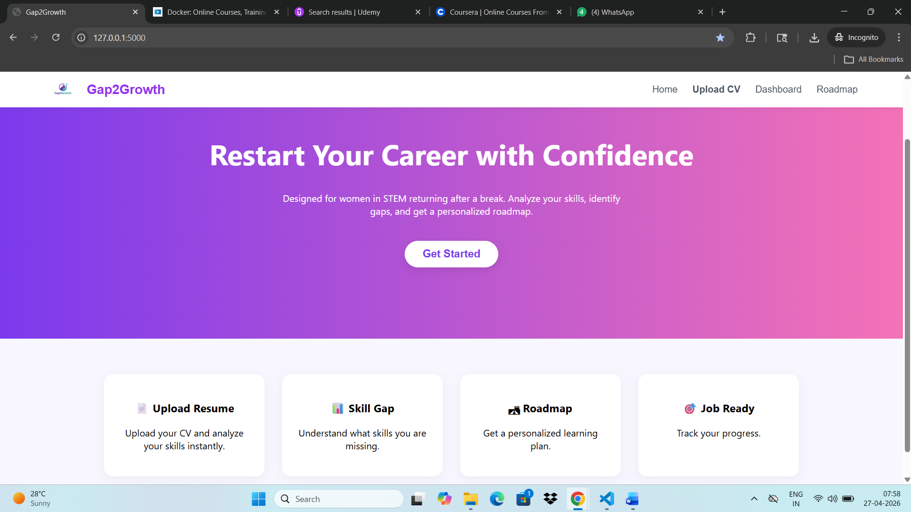
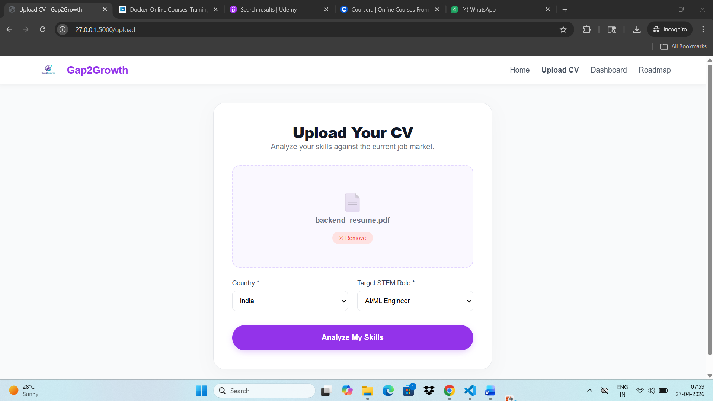
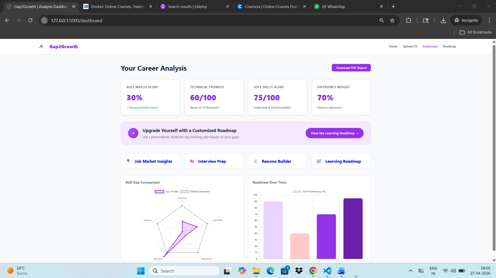
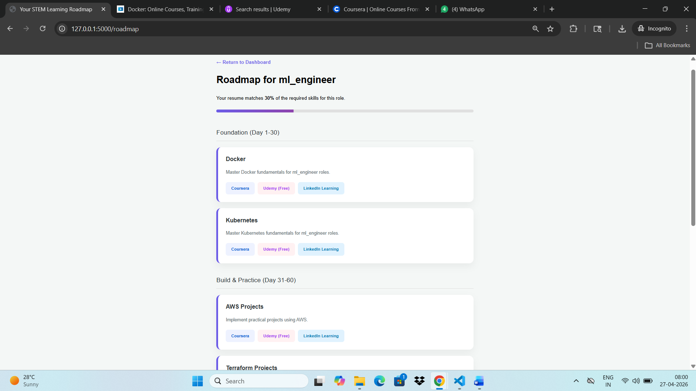
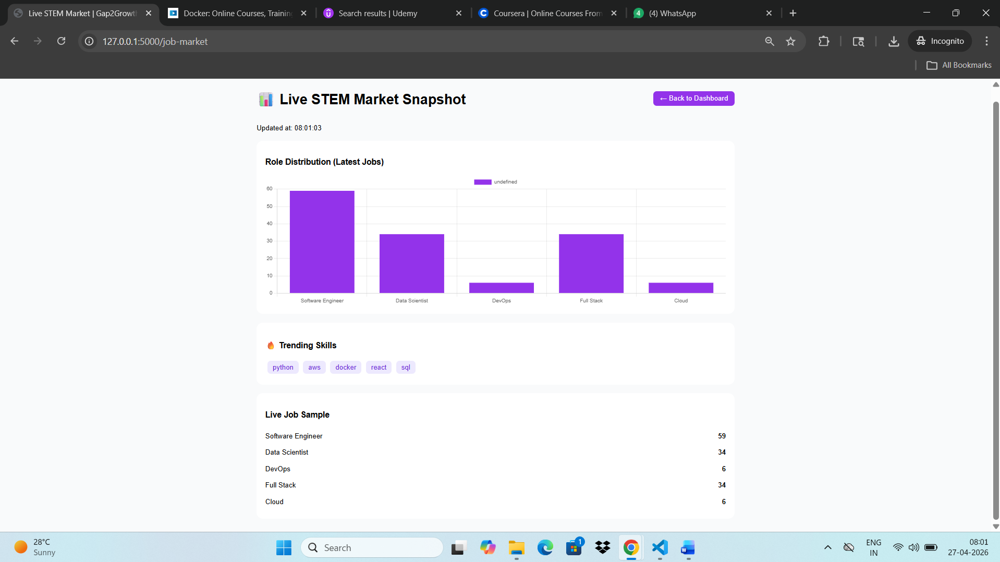
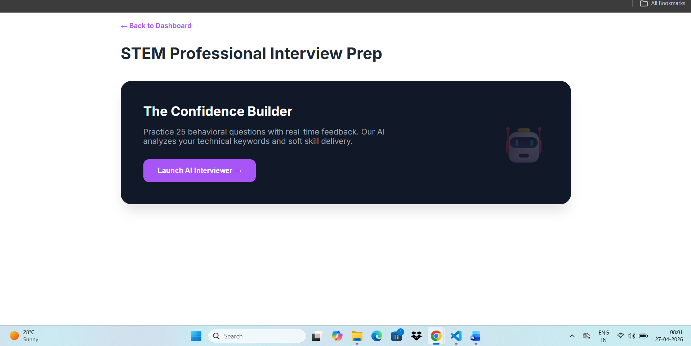
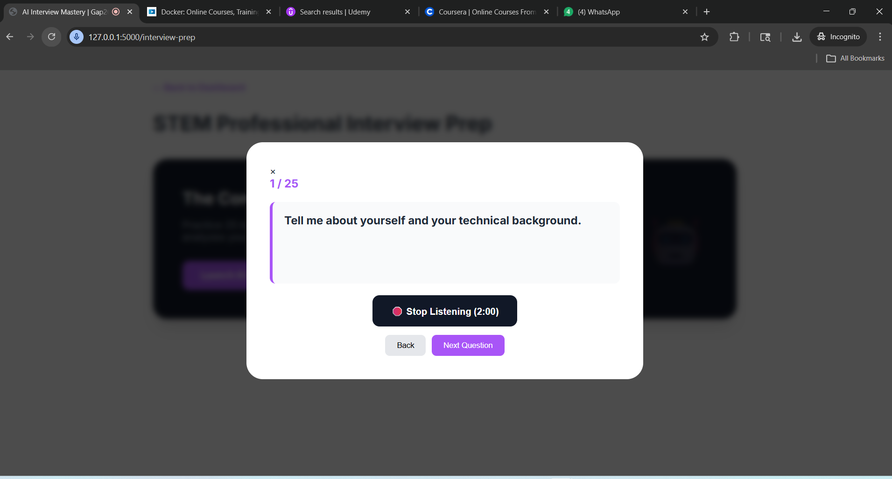
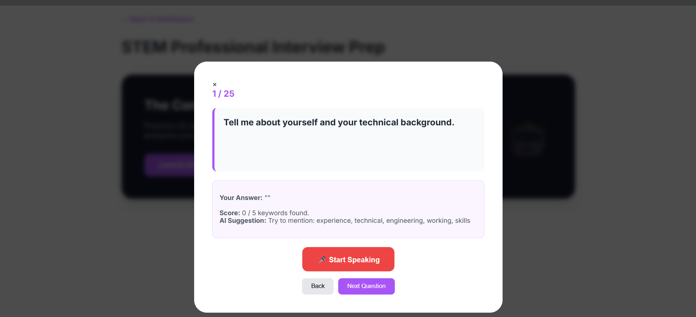
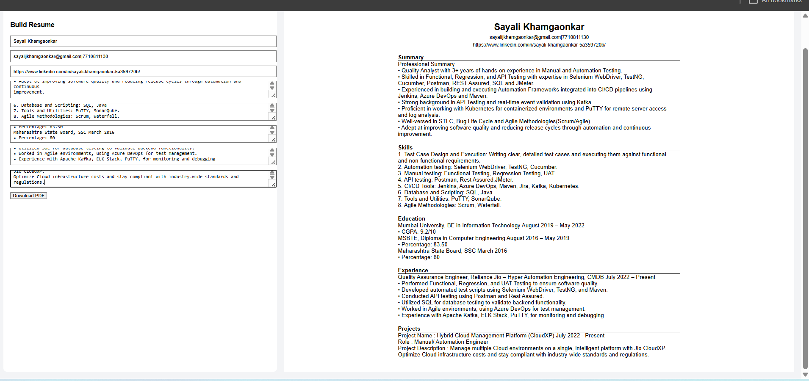
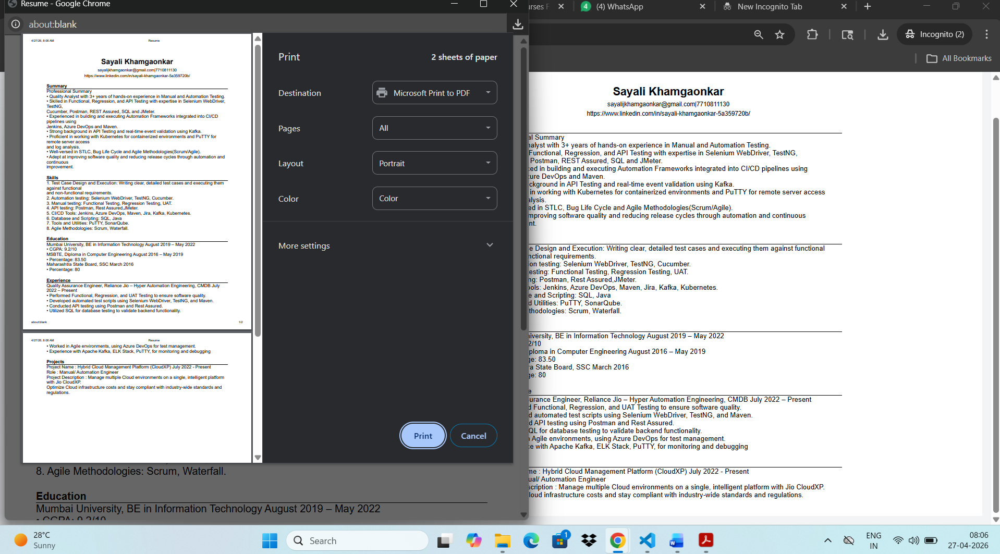

Gap2Growth
AI-powered career roadmap and skill gap analysis platform

## 🎥 Demo Video
Watch the full demo here:  
https://youtu.be/CvUvOHJ1p_w

## 📌 Project Overview
Gap2Growth is a career guidance platform designed to help users identify skill gaps and generate a personalized roadmap based on their current profile and target role.
The platform analyzes uploaded resumes and provides insights into:
- Current skill level
- Role suitability
- Areas of improvement
- Learning roadmap using curated resources
It is built to simplify career transitions (e.g., QA → Data Analyst, DevOps → Backend Developer).

## 📷 Screenshots
### Home 

### Resume Upload

### Dashboard

### Roadmap

### Job Market Insights

### Interview Prep

### AI Interview

### AI Interview Feedback

### Resume Builder

### Resume Builder Download Functuionality

## 🚀 Features
- 📄 Resume Upload & Skill Extraction
- 📊 Personalized Dashboard with Skill Analysis
- 🧭 Career Roadmap based on Target Role
- 📚 Learning Resources (Coursera, Udemy, etc.)
- 💼 Job Insights & Role Matching
- 🎯 Interview Preparation Guidance

  ## 🛠️ Tech Stack
- Frontend: React / HTML / CSS
- Backend: Node.js / Python (update as per yours)
- APIs: Resume Parsing / Custom Logic
- Tools: Git, Postman, etc.

  ## 💡 Why Gap2Growth?
Many users struggle to understand:
- Where they stand in their career
- What skills they lack
- How to transition into new roles
Gap2Growth solves this by providing a structured, data-driven roadmap instead of random learning.

## 🔮 Future Enhancements
- AI-based resume feedback
- Real-time job integration
- Mock interview simulation
- More accurate skill scoring

